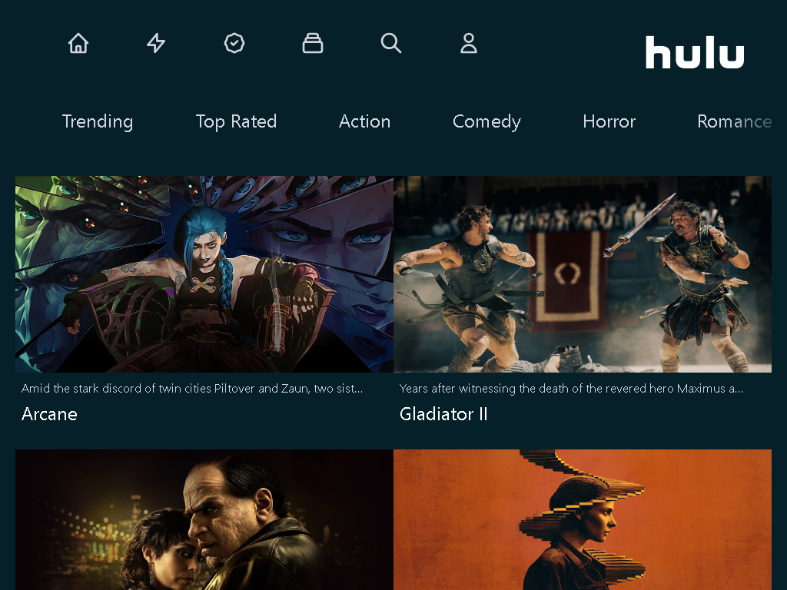
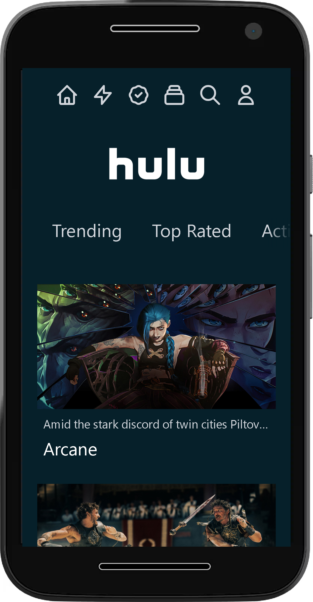

# Hulu Clone

## Descripción

Código base de la aplicación Hulu Clone hecha en Next.js y Tailwind CSS que utiliza la API TMDB.

---

## Vista En Versión Desktop

## Vista En Versión Mobile

---

## Enlace A La Aplicación

- [Hulu Clone](https://hulu-clone-ui-ux.netlify.app/)

---

## Hecho con

- [Heroicons](https://unpkg.com/browse/@heroicons/react@2.0.18/24/outline/) - For Icons
- [Next](https://nextjs.org/) - Next.js
- [React](https://react.dev/) - JS library
- [React Flip Move](https://www.npmjs.com/package/react-flip-move) - For Animations
- [Tailwind CSS](https://tailwindcss.com/) - For Styles
- [TMDB API](https://www.themoviedb.org/?language=es) - For API

---

## Comandos

- npm i
- npm run dev
- npm run build

---

## Dependencias

- @heroicons/react
- Next
- React
- react-flip-move
- tailwind-scrollbar-hide

## Dependencias De Desarrollo

- autoprefixer
- eslint
- postcss
- tailwindcss

---

## Autor

- Website - [Axe10rellana](https://axe10rellana.github.io/portafolio/portafolio/)
